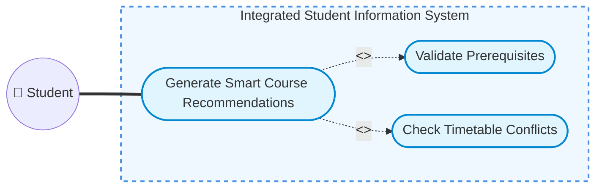
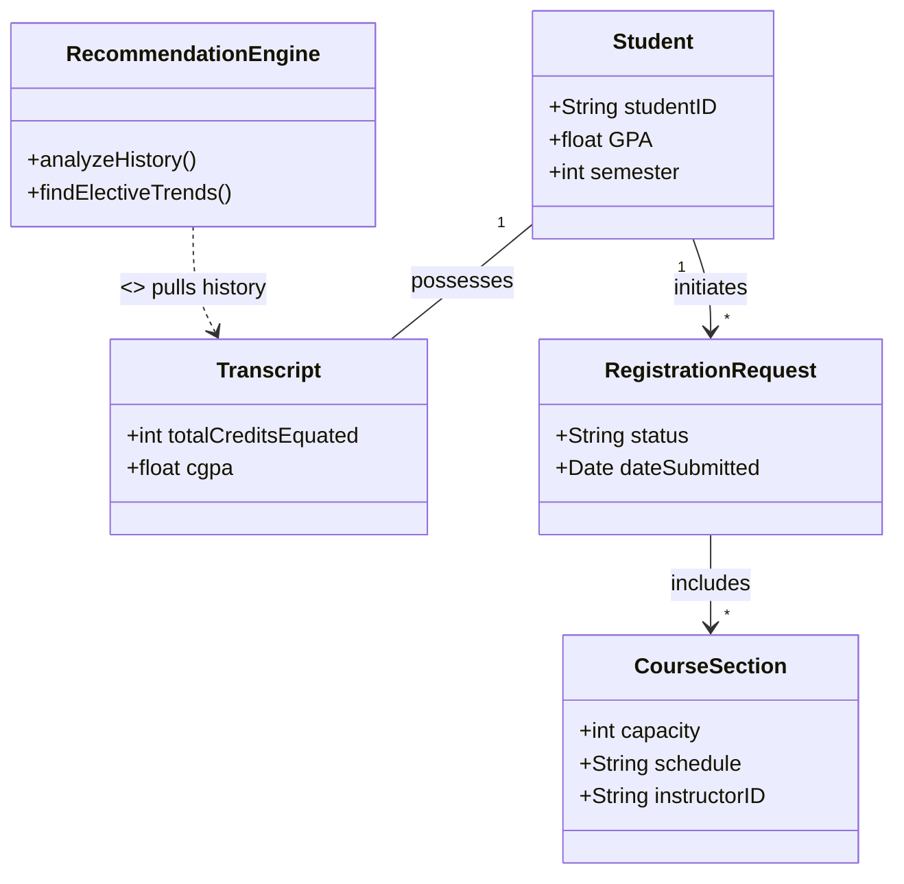

# Midterm Presentation Plan

**Project:** Integrated University Student Information System
**Time Allocation:** 10 minutes presentation + 5 minutes Q&A

---

## Slide 1: Title Slide (1 minute)
* **Project Name:** Integrated University Student Information System
* **Course:** CENG3004 Software Engineering
* **Team Members:** Omar Mohamed Elerakky, Hamdo Alhasan, Hesham Alfadhl, Mohamed elhafedh el gharachi

## Slide 2: Project Motivation (Why? What is the problem?) (2.5 minutes)
* **The Problem:** Most university systems only stop you from taking a class if you don't meet the prerequisite—they don't actually *help* you plan your degree. Students are left on their own, leading to confusing elective choices, missed graduation requirements, and frustrating timetable overlaps.
* **Our Solution:** A unified, centralized platform that seamlessly handles registration, advisory, grading, and graduation auditing all in one place.
* **The Core Innovation:** We augmented the standard flow with a **Smart Course Recommendation Module**. This module analyzes a student's academic history to recommend conflict-free, specialization-focused schedules (e.g., dynamically suggesting *Advanced NLP* if the student successfully completed *AI*). 

## Slide 3: Example Functional Requirement (2 minutes)
* **Requirement (FR-3): Smart Course Recommendation Engine**
* **Description:** The system shall analyze a student’s academic history and automatically recommend a comprehensive course schedule for the upcoming semester.
* **Key Mechanisms:** 
  1. Identifies and prioritizes unfulfilled compulsory courses.
  2. Evaluates past completed electives to uncover a specialization direction, recommending relevant follow-up courses to build a consistent academic pathway.
  3. Executes real-time prerequisite validation and filters out any options that clash in the weekly timetable.

## Slide 4: Example Nonfunctional Requirement (1 minute)
* **Requirement (NR-2): High Availability During Registration Week**
* **Description:** The system must guarantee 99.9% uptime during registration week and remain stable under peak usage.
* **Why it matters:** Registration is the most critical and busiest period in the system.

## Slide 5: One Use Case Diagram (2 minutes)
* **Diagram:** "Generate Smart Course Recommendations" (UC-2)

* **Description of the Drawing:** 
  * Add a primary actor on the left: **Student**.
  * Add the central use case oval: **Generate Smart Course Recommendations**. 
  * Draw a solid association line connecting the Student to this central use case.
  * Add additional use case ovals that are `<<include>>`d: **Validate Prerequisites** and **Check Timetable Conflicts**. Draw dashed arrows pointing to them from the central use case with the `<<include>>` stereotype.

## Slide 6: One Class Diagram (1.5 minutes)
* **Diagram:** Academic Registration and Recommendation Framework

* **Description of the Drawing:** 
  * Draw a central **Student** class (attributes: `studentID`, `GPA`, `semester`).
  * Draw a **Transcript** class and connect it to the Student (1 to 1). This holds historical grades.
  * Draw a **RecommendationEngine** class (methods: `analyzeHistory()`, `findElectiveTrends()`). Show a dependency arrow pointing from it to the Transcript.
  * Draw a **CourseSection** class (attributes: `capacity`, `schedule`, `instructorID`).
  * Draw a **RegistrationRequest** class (attributes: `status`, `dateSubmitted`).
  * Show the relations: A Student explicitly initiates a RegistrationRequest (1 to Many), which includes one or more CourseSections (1 to Many).
