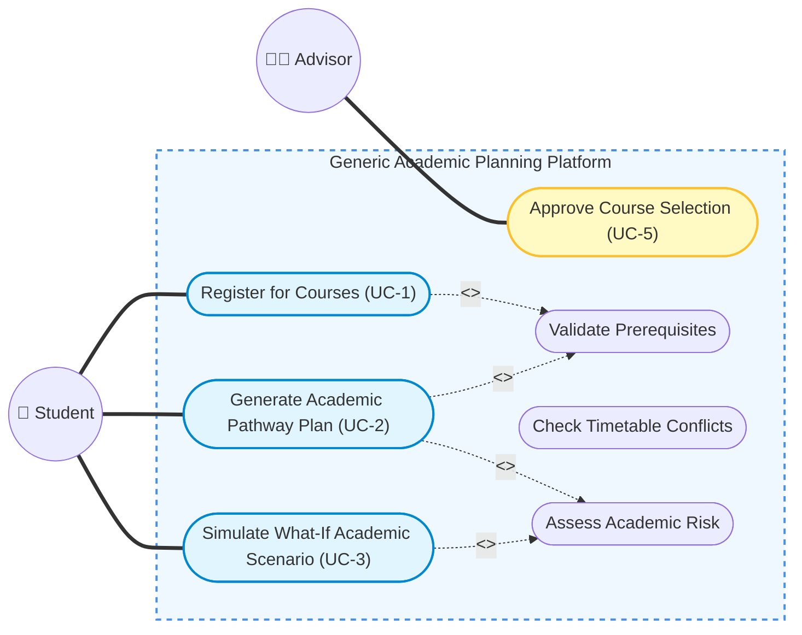
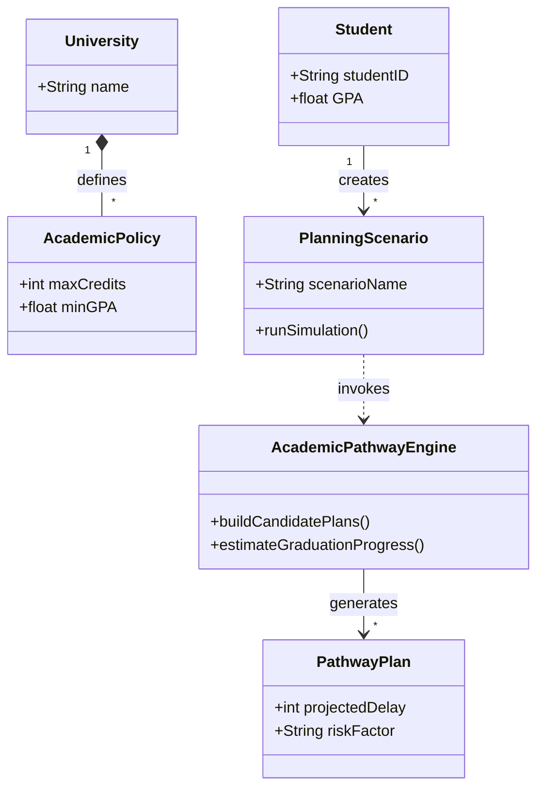

# Midterm Presentation Plan

**Project:** Generic Academic Planning and Decision-Support Platform
**Time Allocation:** 10 minutes presentation + 5 minutes Q&A

---

## Slide 1: Title Slide (1 minute)
* **Project Name:** Generic Academic Planning and Decision-Support Platform
* **Course:** CENG3004 Software Engineering
* **Team Members:** Omar Mohamed Elerakky, Hamdo Alhasan, Hesham Alfadhl, Mohamed elhafedh el gharachi

## Slide 2: Project Motivation (Why? What is the problem?) (2.5 minutes)
* **The Problem:** Traditional OBS systems mainly record and enforce academic operations. They tell a student what they *can* register for today, but fail to help them plan their long-term degree timeline. 
* **Our Solution:** A generic academic pathway planning and decision-support platform that goes beyond standard registration by supporting multi-semester planning, what-if simulations, and configurable policy-aware recommendations.
* **The Core Innovation:** We augmented the standard flow with an **Adaptive Academic Pathway Planning Engine**. This engine simulates entire semesters, tests different career tracks, and ranks them by workload and graduation speed across different departmental rules.

## Slide 3: Example Functional Requirement (2 minutes)
* **Requirement (FR-3): Adaptive Academic Pathway Planning**
* **Description:** The system shall analyze a student’s transcript, institutional policies, and scheduling constraints to generate ranked, multi-semester pathway plans.
* **Key Mechanisms:** 
  1. Identifies and prioritizes unfulfilled compulsory courses.
  2. Runs "What-If" Planning Scenarios (e.g., "What happens if I delay this prerequisite?").
  3. Provides Explainable Tradeoffs, ranking schedule options by "Fastest Graduation", "Balanced Workload", or "Recovery".

## Slide 4: Example Nonfunctional Requirement (1 minute)
* **Requirement (NR-2): High Availability During Registration Week**
* **Description:** The system must guarantee 99.9% uptime during registration week and remain stable under peak usage.
* **Why it matters:** Registration and real-time planning simulations are the most critical and computationally demanding periods in the system.

## Slide 5: Comprehensive Use Case Diagram (2 minutes)
* **Diagram:** The Planning & Smart Scheduling Flow

* **Description of the Drawing:** 
  * **Why present this one?:** It maps two primary actors and introduces the advanced `Assess Academic Risk` include logic natively.
  * **What to highlight:** Point out that standard pathway generation (UC-2) and advanced what-if simulation (UC-3) both reuse shared internal risk validations. This proves the team understands modular UML component design!

## Slide 6: One Class Diagram (1.5 minutes)
* **Diagram:** Configuration and Planning Framework

* **Description of the Drawing:** 
  * **Why present this?:** It visually proves the system is *generic and configurable* across institutions. 
  * **What to highlight:** Show how a `Student` creates a `PlanningScenario`, which invokes the `AcademicPathwayEngine` to generate exactly one or more `PathwayPlan`s. All of this must strictly adhere to the `AcademicPolicy` generated by the master `University` object. This proves architectural scale well beyond a standard OBS schema.
